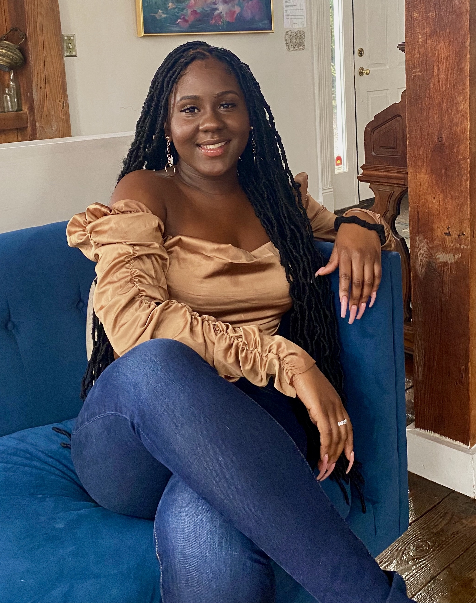

# hi, I'm Ebony 🤎 🌱☕

 I am: frontend software engineer, technical writer, and community advocate who is passionate about wellness, accessbility, DEI, & self-improvement.

pronouns: she/her

languages & frameworks: js/react/redux/typescript

studying: computer science fundamentals, data structures & algorithms

interested in: learning more about cloud & cybersecurity

building: a simple recipe generator that takes any keyword & returns a vegan or vegetarian version! 
fun fact: I live with my adorable best friend & unemployed roommate, a maltipoo named Maji[]

follow me for tech opinions, programming jokes, and live-tweets about my wins and failures at work: 
